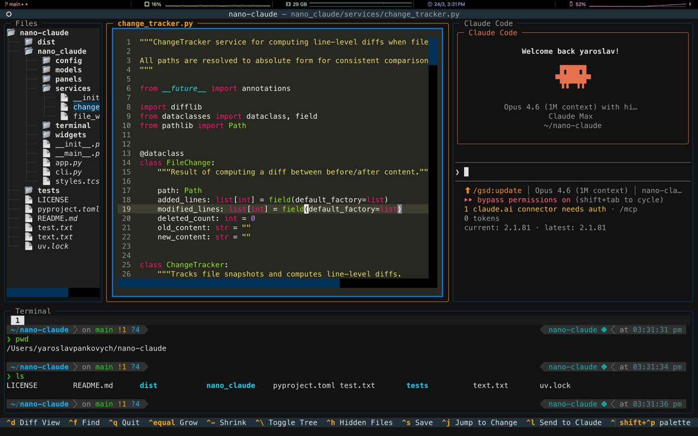

# nano-claude

A terminal-native IDE that embeds [Claude Code](https://docs.anthropic.com/en/docs/claude-code) as a first-class panel alongside a code editor, file tree, and terminal. One terminal window, everything in view.




## Why

Claude Code is powerful, but using it means constantly switching between your terminal and editor to review changes. nano-claude puts them side by side: see Claude's edits the moment they happen, and let Claude see what you're looking at.

## Install

```bash
# With pipx (recommended — isolated install)
pipx install nano-claude

# With pip
pip install nano-claude
```

### Prerequisites

- Python 3.12+
- [Claude Code CLI](https://docs.anthropic.com/en/docs/claude-code) installed and authenticated

## Usage

```bash
# Open current directory
nano-claude

# Open a specific project
nano-claude ~/projects/my-app
```

> **Note:** Claude Code starts in **yolo mode** (`--dangerously-skip-permissions`) by default, so it can edit files, run commands, and use tools without confirmation prompts.

## Keyboard Shortcuts

### Navigation

| Key | Action |
|-----|--------|
| `Ctrl+b` | Focus file tree |
| `Ctrl+e` | Focus editor |
| `Ctrl+r` | Focus chat |
| `Tab` / `Shift+Tab` | Cycle panels |
| `Ctrl+=` / `Ctrl+-` | Grow / shrink panel |
| `Ctrl+\` | Toggle file tree |
| `Ctrl+h` | Toggle hidden files |

### Editing

| Key | Action |
|-----|--------|
| `Ctrl+s` | Save file |
| `Ctrl+f` | Find in file |
| `Ctrl+c` | Copy (when text selected) / Cancel (in terminal) |

### Claude Integration

| Key | Action |
|-----|--------|
| `Ctrl+l` | Send code selection to Claude |
| `Ctrl+p` | Pin/unpin ambient context |
| `Ctrl+Shift+r` | Restart Claude |

### Change Detection

| Key | Action |
|-----|--------|
| `Ctrl+j` | Jump to Claude's latest change |
| `Ctrl+d` | Toggle inline diff view |

### Terminal Panel

| Key | Action |
|-----|--------|
| `Ctrl+t` | Toggle terminal panel |
| `Ctrl+n` | New terminal tab |
| `Ctrl+w` | Close terminal tab |
| `Ctrl+Shift+Left/Right` | Switch tabs |
| Mouse wheel | Scroll through history |

### General

| Key | Action |
|-----|--------|
| `Ctrl+q` | Quit |

## Features

- **Three-panel layout** — file tree, syntax-highlighted editor, and Claude Code chat side by side
- **Embedded Claude Code** — full PTY integration with streaming output, status indicators, and token tracking
- **Auto-jump to changes** — when Claude edits a file, the editor jumps to the change with highlights
- **Inline diff view** — toggle unified diff to see exactly what changed
- **Send code to Claude** — select code and send it with `Ctrl+l`, or pin context with `Ctrl+p`
- **Multi-tab terminal** — integrated shell terminal with tab management
- **Scrollback history** — smooth scroll through terminal and Claude output history
- **File watching** — tree auto-updates when files change on disk
- **Responsive layout** — panels adapt to terminal size, collapse gracefully

## Development

```bash
git clone https://github.com/yaroslavpankovych/nano-claude.git
cd nano-claude
python -m venv .venv
source .venv/bin/activate
pip install -e ".[dev]"

# Run
nano-claude

# Test
pytest
```

## License

MIT
